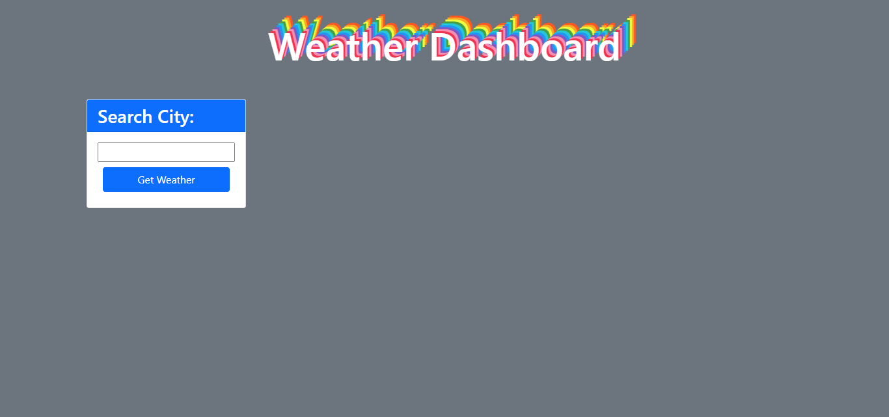
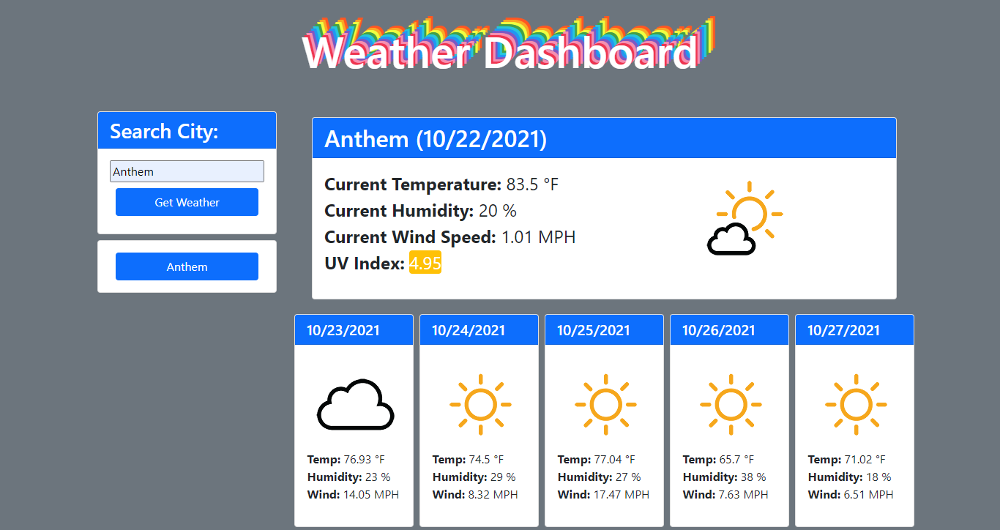
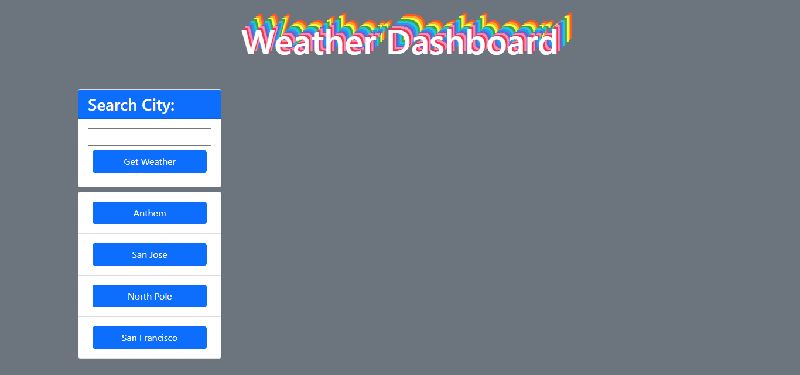

# Weather Dashboard 🌤️
## Description
- Building a weather dashboard has been a great way for me to test out my coding skills that we have learned so far and to implement server side API's in a fun way.
- To begin building the dashboard I started with fetching the location API provided by Open Weather. When a user enters in the city it was then able to get the latitude and longitude from the city name they entered. Using the latitude and longitude, I was then able to use then to fetch the weather API also provided by Open Weather. With this new data, I was ready to start building the new DOM elements to display to show the current weather as well as the five day future forecast.
- A problem that I ran into building this project was saving the city information without it duplicating. I was able to figure out how to get rid of any history duplicates on reload but when I refactor the code I hope to be able to figure out how to make sure there are no duplicates on the page without a reload, maybe in the updateHistory function.
- This is definitely my favorite project that we have done so far, I have had a lot of fun with it. I feel very comfortable with starting to work with server side API's and am so excited to see what I will create in the future because it has opened up a world of possibilities.
## Table of Contents
- [Usage](#usage)
- [License](#license)
## Usage
### Links
- [ViewWebsite](https://haileythomas.github.io/weather-dashboard/) view deployed website
- [GitHub](https://github.com/HaileyThomas/weather-dashboard) view on GitHub
### Screenshots
- 
- Open website and enter in the name of the city you'd like the see the weather for.
- 
- Click the submit button and view the current weather as well as a five day future forecast.
- 
- Your city search history will be saved, even on reload, and you can click on a city from your history and view it's weather.

## License
MIT License

Copyright (c) [2021] [HaileyThomas]

Permission is hereby granted, free of charge, to any person obtaining a copy
of this software and associated documentation files (the "Software"), to deal
in the Software without restriction, including without limitation the rights
to use, copy, modify, merge, publish, distribute, sublicense, and/or sell
copies of the Software, and to permit persons to whom the Software is
furnished to do so, subject to the following conditions:

The above copyright notice and this permission notice shall be included in all
copies or substantial portions of the Software.

THE SOFTWARE IS PROVIDED "AS IS", WITHOUT WARRANTY OF ANY KIND, EXPRESS OR
IMPLIED, INCLUDING BUT NOT LIMITED TO THE WARRANTIES OF MERCHANTABILITY,
FITNESS FOR A PARTICULAR PURPOSE AND NONINFRINGEMENT. IN NO EVENT SHALL THE
AUTHORS OR COPYRIGHT HOLDERS BE LIABLE FOR ANY CLAIM, DAMAGES OR OTHER
LIABILITY, WHETHER IN AN ACTION OF CONTRACT, TORT OR OTHERWISE, ARISING FROM,
OUT OF OR IN CONNECTION WITH THE SOFTWARE OR THE USE OR OTHER DEALINGS IN THE
SOFTWARE.
